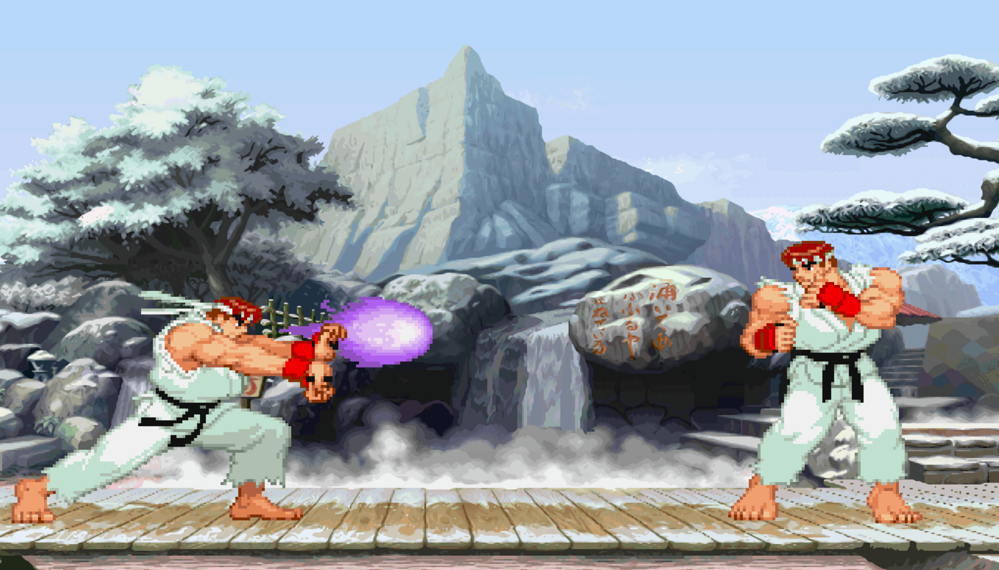

# Street Pyter



A retro-style fighting game inspired by Street Fighter, built with Pygame.

[](url)

## Game Features
- Two-player fighting game
- Special moves (Hadouken)
- Multiple attack types (punches and kicks)
- Health bar system
- Controller support

## Controls

### Player 1 (Keyboard)
- Movement: WASD
- Attacks: UIOJKL
  - U: Low Punch
  - I: Medium Punch
  - O: High Punch
  - J: Low Kick
  - K: Medium Kick
  - L: High Kick
- Special Move (Hadouken): Down, Down-Forward, Forward + Punch

### Player 2 (Keyboard)
- Movement: Arrow Keys
- Attacks: 123456
  - 1: Low Punch
  - 2: Medium Punch
  - 3: High Punch
  - 4: Low Kick
  - 5: Medium Kick
  - 6: High Kick
- Special Move (Hadouken): Down, Down-Forward, Forward + Punch

### Controller Support
- Left Stick: Movement
- ABXY + Bumpers: Attacks
- Special moves work the same as keyboard

## How to Play
Download and unzip the latest release!
Or to build yourself:
1. Download and extract the game files
2. Install Python 3.8 or later
3. Install requirements: `pip install -r requirements.txt`
4. Run the game: `python main.py`

## Requirements
- Python 3.8+
- Pygame 2.0+
- A controller (optional)

## Technical Documentation

### Architecture Overview
The game follows an object-oriented design with the following core components:

### Core Classes
- `Fighter`: Base class for player characters
  - Manages character state, animations, and move execution
  - Handles collision detection and hit registration
  - Implements special move recognition system

- `Game`: Main game controller
  - Manages game state and player instances
  - Handles input processing and event management
  - Controls game flow and round system

### Key Modules
- `lib.py`: Core game utilities and helper functions
  - Drawing functions for UI elements
  - Input processing and move validation
  - Collision detection algorithms

- `settings.py`: Game configuration
  - Constants for game mechanics (health, speed, gravity)
  - Screen dimensions and UI settings
  - Control mappings

### File Structure
```
├── main.py         # Game entry point
├── lib.py          # Core utilities
├── settings.py     # Configuration
└── assets/         # Game resources
    └── stage.png   # Game background
```


## License
This game is free to play and distribute.
